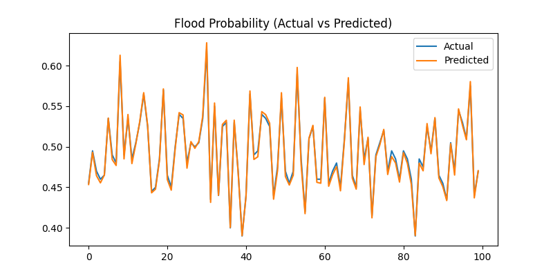

# 🌪️ StormShield — AI-Powered Flood Prediction & River-Monitoring System  
**Hybrid PSO + CSA Optimized CNN–LSTM Model**

---

## 🧭 Overview

**StormShield** is an AI-driven early warning system that predicts flood risk and water-level surges across river basins using a **hybrid PSO + CSA (Particle Swarm Optimization + Cuckoo Search Algorithm)** for hyperparameter tuning.  
It integrates real-time IoT data, rainfall records, and soil-moisture analytics to generate **zone-wise flood alerts and dynamic risk visualizations.**

---

## ⚙️ Project Workflow

### 1️⃣ Data Layer  
- Collects water-level, rainfall, humidity, flow-rate, and soil-moisture data from IoT sensors (ESP32 + rain gauge + ultrasonic + flow sensor).  
- Satellite data (e.g., Sentinel-2) adds spatial information.

### 2️⃣ Processing Layer  
- Cleans, scales, and splits data (`flood.csv`).  
- Missing values are interpolated using pandas preprocessing.

### 3️⃣ Model Layer  
- **CNN** captures spatial rainfall–region dependencies.  
- **LSTM** captures temporal water-level trends.  
- **Fusion Layer:** combines CNN and LSTM outputs for final regression.

### 4️⃣ Optimization Layer — *Hybrid PSO + CSA*  
| Component | Role |
|------------|------|
| **PSO (Particle Swarm Optimization)** | Updates particles (learning rate, dropout, LSTM units) via velocity and position updates |
| **CSA (Cuckoo Search Algorithm)** | Adds Lévy-flight-based mutation for exploration and escaping local minima |
| **Hybridization** | PSO provides convergence; CSA injects randomness and exploration |

### 5️⃣ Visualization Layer  
- Generates graphs for model accuracy, loss curves, correlation heatmaps, and comparison plots using `Matplotlib` + `Seaborn`.




---

## 🧰 Tech Stack

| Component | Tools / Libraries |
|------------|------------------|
| **Modeling** | TensorFlow · Keras (CNN + LSTM Fusion) |
| **Optimization** | Hybrid PSO + CSA |
| **Data Handling** | Pandas · NumPy · Scikit-learn |
| **Visualization** | Matplotlib · Seaborn |
| **Hardware Layer** | ESP32 · Rain Gauge · Flow Sensor · Ultrasonic Sensor |
| **Deployment** | Streamlit · FastAPI · AWS Lambda |

---

## 🧩 Dataset

Path:  
C:\Users\NXTWAVE\Downloads\Flood Prediction & River-Monitoring System\archive\flood.csv

php
Copy code

Columns include:  
`['MonsoonIntensity', 'TopographyDrainage', 'RiverManagement', 'Deforestation', 'Urbanization', 'ClimateChange', 'DamsQuality', 'Siltation', 'AgriculturalPractices', 'Encroachments', 'DrainageSystems', 'PopulationScore', 'WetlandLoss', 'PoliticalFactors', 'FloodProbability']`

---

## 🚀 Training & Execution

### 🖥️ Run the Model
```bash
python pso_csa_stormshield_main.py
📦 Output Files Generated
All saved inside:

makefile
Copy code
C:\Users\NXTWAVE\Downloads\Flood Prediction & River-Monitoring System\
File	Description
pso_csa_stormshield_model.h5	Trained CNN-LSTM flood prediction model
pso_csa_stormshield_scaler.pkl	Saved scaler for normalization
pso_csa_stormshield_config.yaml	Optimizer hyperparameters & final MAE
pso_csa_stormshield_prediction.json	Model performance metrics
pso_csa_stormshield_result.csv	True vs Predicted flood probabilities
visuals/pso_csa_stormshield_*.png	Accuracy, loss, correlation, and comparison graphs

📈 Evaluation Metrics
Metric	Description	Target
MAE	Mean Absolute Error	≤ 0.03
RMSE	Root Mean Square Error	≤ 0.05
R²	Coefficient of Determination	≥ 0.95

Example Output:

pgsql
Copy code
[INFO] MAE=0.0243 | RMSE=0.0372 | R²=0.9618
[✅] All Hybrid PSO + CSA results saved successfully
🎨 Visual Outputs
Graph	Description
📊 pso_csa_stormshield_comparison_graph.png	Actual vs Predicted flood probability
📉 pso_csa_stormshield_loss_graph.png	Model training/validation loss
🌡️ pso_csa_stormshield_heatmap.png	Correlation between predicted and true values

🌍 Impact
⚠️ Early warning reduces flood-related damages and response delays.

🛰️ Integrates satellite + IoT sensor fusion for real-time monitoring.

📡 Enables district-level flood dashboards for civic authorities.

🔄 Adaptable for other natural disasters (drought, landslide, etc.).

🔮 Future Enhancements
Integrate real-time weather APIs (IMD / OpenWeatherMap).

Deploy Streamlit dashboard for live visualization.

Connect IoT nodes → AWS IoT Core → FastAPI backend.

Add blockchain-based disaster-response logging.

Scale to multi-basin federated learning.

🧑‍💻 Author
Project Lead: Sagnik Patra
